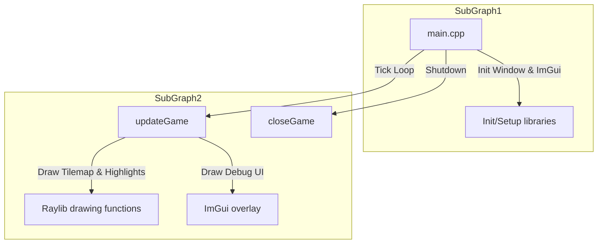
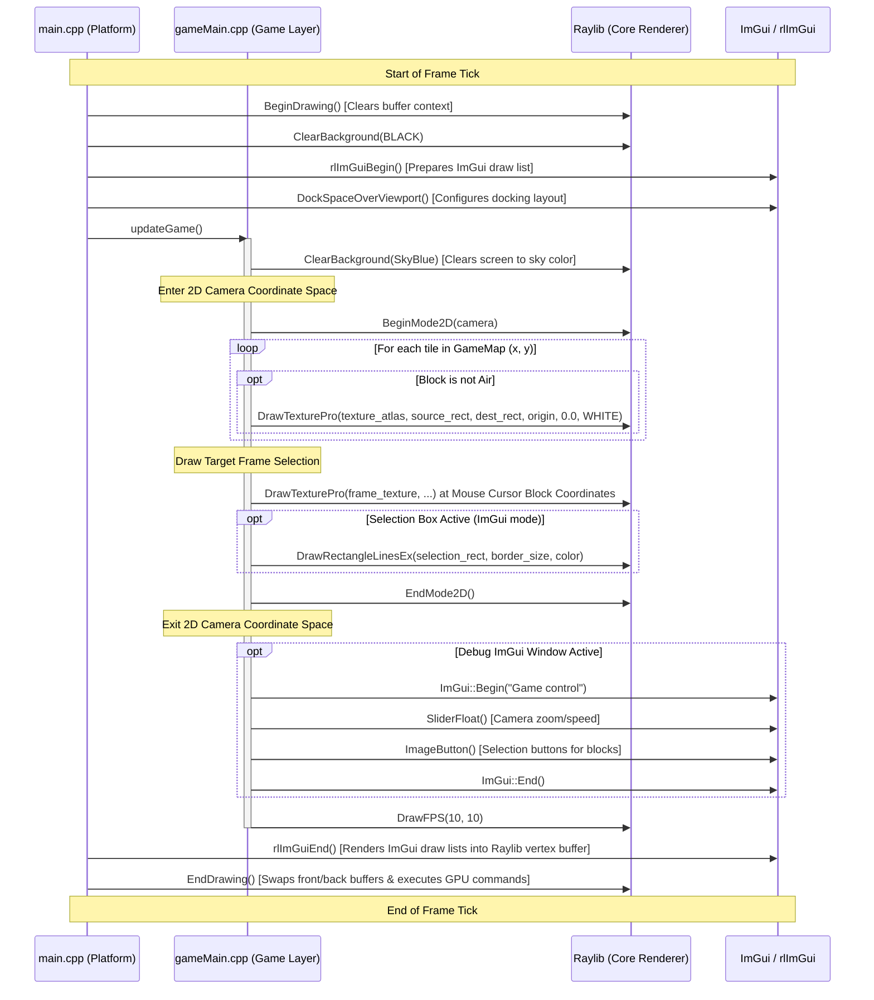

# Architecture and Rendering Pipeline of `cppgamedev`

This document details the architecture, rendering pipeline, asset management, world generation, and overall structure of the C++ game engine.

---

## Table of Contents
1. [High-Level Architecture](#1-high-level-architecture)
2. [The Rendering Pipeline](#2-the-rendering-pipeline)
3. [The Core Game Loop & Delta Time](#3-the-core-game-loop--delta-time)
4. [World Generation & Terrain Pipeline](#4-world-generation--terrain-pipeline)
5. [Subsystems & Modules](#5-subsystems--modules)
   - [Asset Manager](#asset-manager)
   - [Map Serialization](#map-serialization)
   - [Structures System](#structures-system)
   - [Platform Assertions](#platform-assertions)
6. [Codebase Directory Map](#6-codebase-directory-map)

---

## 1. High-Level Architecture

The engine is split into two primary layers to decouple the platform/windowing code from actual game logic:

1. **Platform Layer ([src/platform](file:///Users/garvitsingla/Developer/Projects/cppgamedev/src/platform))**:
   - Manages OS integration, window creation, input polling, and frame-rate targeting.
   - Initializes rendering contexts (Raylib and Dear ImGui via `rlImGui`).
   - Runs the main infinite loop and routes tick events to the game layer.

2. **Game Layer ([src/gameLayer](file:///Users/garvitsingla/Developer/Projects/cppgamedev/src/gameLayer))**:
   - Manages core gameplay logic, the camera state, map data structure, terrain generation, and GUI debug controls.
   - Decoupled from the OS entry-point via three simple lifecycle functions: `initGame()`, `updateGame()`, and `closeGame()`.

### Block Diagram



---

## 2. The Rendering Pipeline

The rendering pipeline executes frame-by-frame on a single thread. The sequence of actions for every frame is as follows:



### Detailed Rendering Pipeline Steps

1. **Clear Screen Context**:
   - `main.cpp` clears the background to `BLACK`.
   - `gameMain.cpp` immediately clears the background to `SKYBLUE` (`{135, 206, 235, 255}`) when `updateGame()` is called, ensuring the sky is rendered behind all tiles.
   
2. **2D Camera Coordinate Transformation (`BeginMode2D`)**:
   - The game enters Raylib's 2D rendering mode by passing the `camera` object.
   - The `camera` structure coordinates translation (position target offset to center coordinates) and scale (zoom).
   - This scales world units (1 unit = 1 pixel or block) automatically to screen pixels depending on `camera.zoom` (default is `30.0f`).

3. **Tile Drawing Loop**:
   - The game loops over every block in the `GameMap` size defined by width (`w = 900`) and height (`h = 500`).
   - For any block where `type != Block::air`, the engine queries `assetManager.textures` (the global texture atlas) and grabs a sub-rectangle corresponding to the block type index using `getTextureAtlas(b.type, 0, 32, 32)`.
   - Drawing is done via `DrawTexturePro`:
     - **Source Rectangle**: Sub-rectangle of the block in the texture atlas (`32x32` pixels starting from `(b.type * 32, 0)`).
     - **Destination Rectangle**: Position in world coordinate space: `{x, y, 1, 1}` (where `x` and `y` are the indices of the blocks). Since block scale `size` is set to `1.0f`, each block is drawn at its map coordinate coordinate system directly.

4. **Target Highlighting**:
   - The mouse screen coordinates are converted into world-coordinates using `GetScreenToWorld2D(...)`.
   - The floor/integer division defines the block coordinate `(blockX, blockY)` the mouse is currently hover-targeting.
   - A selection frame texture (`assetManager.frame`) is drawn overlaying this block coordinate with unit scale `{1, 1}`.

5. **2D Camera End (`EndMode2D`)**:
   - Camera matrices are popped, restoring normal screen coordinates.

6. **Dear ImGui Debug Rendering**:
   - Renders debug windows (e.g., `"Game control"`) to configure zoom factor and swap block brush textures.
   - The block buttons inside ImGui calculate UV texture coords on the fly from the texture atlas.

---

## 3. The Core Game Loop & Delta Time

To guarantee consistent physics and camera navigation across machines with different framerates:

- **Delta Time Polling**: The engine polls Raylib's `GetFrameTime()` to find the elapsed time since the last frame.
- **Damping Limit**: If a lag spike occurs, `deltaTime` is clamped to a maximum of `0.2s` (`1.0f / 5`) to prevent floating-point calculation errors or huge jumps.
- **Camera Navigation**: Target coordinates are updated by multiplying the movement rate with `deltaTime` and a speed multiplier (default: 7.0f units/sec):
  ```cpp
  if (IsKeyDown(KEY_LEFT))
      gameData.camera.target.x -= 7.f * deltaTime * CAMERA_SPEED;
  ```

---

## 4. World Generation & Terrain Pipeline

Terrain is procedural and generated inside `worldGenerator.cpp` using the `FastNoiseSIMD` library:

1. **Initialization**: Creates a `GameMap` of dimensions `900x500` blocks.
2. **Noise Setup**:
   - Instantiates two SIMD-accelerated noise generators: one for `dirt` surface variations and another for deeper `stone` layers.
   - Configures the generators using fractal simplex noise with specific octaves and frequencies (`0.02` for dirt, `0.01` for stone).
3. **Array Retrieval**:
   - Grabs pre-allocated sets of floats (`float*`) matching map width `w`.
   - Fills these sets using the SIMD generators and normalizes output range from `[-1, 1]` to `[0, 1]`.
4. **Height mapping**:
   - **Stone Height**: Calculated by interpolating a baseline height range of `[80, 170]` using the `stoneNoise` value at index `x`.
   - **Dirt Height**: Calculated by offsetting the stone surface height upward by a value in range `[-5, 35]` modulated by `dirtNoise`.
5. **Block Filling**:
   - The generator iterates over the map column-by-column:
     - `y > dirtHeight`: Filled with `Block::dirt`.
     - `y == dirtHeight`: Filled with `Block::grassBlock`.
     - `y >= stoneHeight`: Filled with `Block::stone`.
     - Otherwise, the block type defaults to `Block::air` (`0`).

```
Y-Axis
▲
│    Air (Clear / Sky)
│
┼─────────────────────────   y == dirtHeight (Grass Block)
│    Dirt Layer
│
┼- - - - - - - - - - - - -   y == stoneHeight (Transition)
│    Stone / Cave Layer
▼
```

---

## 5. Subsystems & Modules

### Asset Manager
Declared in [assetManager.h](file:///Users/garvitsingla/Developer/Projects/cppgamedev/src/gameLayer/assetManager.h) and implemented in [assetManager.cpp](file:///Users/garvitsingla/Developer/Projects/cppgamedev/src/gameLayer/assetManager.cpp). It handles loading texture resources from the hardcoded folder defined by cmake build target:
- `dirt.png` (singular block fallback)
- `textures.png` (full block sheet atlas, each cell sized `32x32` pixels)
- `frame.png` (selection frame highlight overlay)

### Map Serialization
Declared in [saveMap.h](file:///Users/garvitsingla/Developer/Projects/cppgamedev/src/gameLayer/saveMap.h) and implemented in [saveMap.cpp](file:///Users/garvitsingla/Developer/Projects/cppgamedev/src/gameLayer/saveMap.cpp). It handles binary persistence of the block list:
- **Save**: Writes a header containing width (`w`, 4 bytes), height (`h`, 4 bytes), and raw binary blocks data array (`sizeof(Block) * w * h` bytes) straight to the file.
- **Load**: Performs validation checks (checks file stream, size boundaries up to `100,000` tiles to avoid memory overflow attacks) and reads direct bytes back to rebuild the map.

### Structures System
Defined in [structure.h](file:///Users/garvitsingla/Developer/Projects/cppgamedev/src/gameLayer/structure.h) and [structure.cpp](file:///Users/garvitsingla/Developer/Projects/cppgamedev/src/gameLayer/structure.cpp). It mimics a smaller sub-region buffer of blocks. This holds coordinates width (`w`) and height (`h`) and a vector of block structures. This can be used for copying regions of the world map (selection/copy-paste tools).

### Platform Assertions
A custom safety utility implemented in [asserts.h](file:///Users/garvitsingla/Developer/Projects/cppgamedev/src/platform/asserts.h) and [asserts.cpp](file:///Users/garvitsingla/Developer/Projects/cppgamedev/src/platform/asserts.cpp):
- Distinguishes development and production builds via `#if DEVELOPLEMT_BUILD == 1`.
- On Windows, uses system modals (`MessageBoxA`) with retry/abort buttons and calls `__debugbreak()` to halt execution inside a debugger.
- On Unix-based systems (like macOS), prints error logs to `std::cout` and triggers `__builtin_trap()` to force debugger halts.

---

## 6. Codebase Directory Map

- 📁 [src](file:///Users/garvitsingla/Developer/Projects/cppgamedev/src) - Root source directory.
  - 📁 [platform](file:///Users/garvitsingla/Developer/Projects/cppgamedev/src/platform) - Platform layer (OS & initialization).
    - 📄 [main.cpp](file:///Users/garvitsingla/Developer/Projects/cppgamedev/src/platform/main.cpp) - Game entrypoint, initialization, and primary loop.
    - 📄 [asserts.h](file:///Users/garvitsingla/Developer/Projects/cppgamedev/src/platform/asserts.h) / [asserts.cpp](file:///Users/garvitsingla/Developer/Projects/cppgamedev/src/platform/asserts.cpp) - Custom debugging assertion subsystem.
  - 📁 [gameLayer](file:///Users/garvitsingla/Developer/Projects/cppgamedev/src/gameLayer) - Core game systems.
    - 📄 [gameMain.h](file:///Users/garvitsingla/Developer/Projects/cppgamedev/src/gameLayer/gameMain.h) / [gameMain.cpp](file:///Users/garvitsingla/Developer/Projects/cppgamedev/src/gameLayer/gameMain.cpp) - Game state tick loop, camera positioning, and rendering logic.
    - 📄 [gameMap.h](file:///Users/garvitsingla/Developer/Projects/cppgamedev/src/gameLayer/gameMap.h) / [gameMap.cpp](file:///Users/garvitsingla/Developer/Projects/cppgamedev/src/gameLayer/gameMap.cpp) - Map allocation and block access safety checks.
    - 📄 [blocks.h](file:///Users/garvitsingla/Developer/Projects/cppgamedev/src/gameLayer/blocks.h) - Enum definition of blocks types and core structures.
    - 📄 [worldGenerator.h](file:///Users/garvitsingla/Developer/Projects/cppgamedev/src/gameLayer/worldGenerator.h) / [worldGenerator.cpp](file:///Users/garvitsingla/Developer/Projects/cppgamedev/src/gameLayer/worldGenerator.cpp) - Procedural terrain using Simplex SIMD noise.
    - 📄 [assetManager.h](file:///Users/garvitsingla/Developer/Projects/cppgamedev/src/gameLayer/assetManager.h) / [assetManager.cpp](file:///Users/garvitsingla/Developer/Projects/cppgamedev/src/gameLayer/assetManager.cpp) - Texture loader.
    - 📄 [saveMap.h](file:///Users/garvitsingla/Developer/Projects/cppgamedev/src/gameLayer/saveMap.h) / [saveMap.cpp](file:///Users/garvitsingla/Developer/Projects/cppgamedev/src/gameLayer/saveMap.cpp) - Block binary serialization tool.
    - 📄 [structure.h](file:///Users/garvitsingla/Developer/Projects/cppgamedev/src/gameLayer/structure.h) / [structure.cpp](file:///Users/garvitsingla/Developer/Projects/cppgamedev/src/gameLayer/structure.cpp) - Map copy-paste selection structures.
    - 📄 [helpers.h](file:///Users/garvitsingla/Developer/Projects/cppgamedev/src/gameLayer/helpers.h) / [helpers.cpp](file:///Users/garvitsingla/Developer/Projects/cppgamedev/src/gameLayer/helpers.cpp) - Atlas texture region calculations.
    - 📄 [randomStuff.h](file:///Users/garvitsingla/Developer/Projects/cppgamedev/src/gameLayer/randomStuff.h) / [randomStuff.cpp](file:///Users/garvitsingla/Developer/Projects/cppgamedev/src/gameLayer/randomStuff.cpp) - PRNG utilities.
